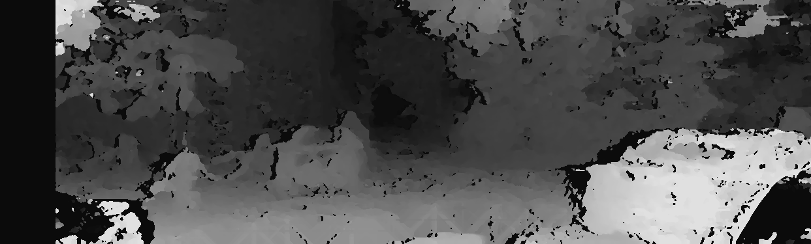
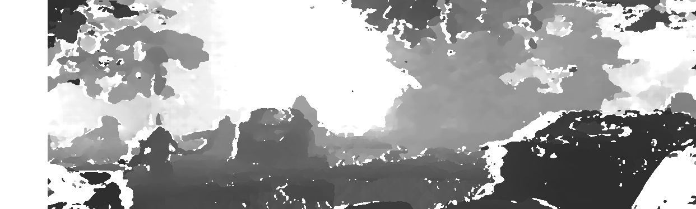

# Reconstruction
- update: 之前八点法后进行reconstruction的时候, scale我理解的有问题, 现在已经修复了
- 目前估计R和t的流程是采用ORB或者SIFT进行八点法, 然后将结果送入bundle adjustment中进行优化, 但是这个结果的精度我个人觉得不足以做到很好的rectify
- 我觉得实验可以分为两个部分: 
  - 1. 已知R和t的ground truth, 分别使用ORB和SIFT分别计算R和t, 然后再送入bundle adjustment中进行优化, 计算这个估计值的误差
  - 2. 使用数据集中rectified后的图像进行block matching, semi-global matching和学习的方法进行深度估计, 然后评估质量

# Dataset 
- KITTI_TEST
  - ./test_images/kitti_test_01
  - 这个数据集中包含左右两张图像， 是KITTI中rectified的两张图像(rectified KITTI - 2011_09_26_drive_0113_sync - 0.png)
  - 增加: 2011_09_26_drive_0048_sync - 1.png
- KITTI_2015
  - 杨谦益所选的带有深度ground truth的图像
- MATLAB_TEST
  - ./test_images/matlab
  - 这个数据集中包含左右两张rectified的图像，来源于CV2的exe6
- KITTI_2011_09_26_drive_0048
  - KITTI官网Raw Data
  - 2011_09_26_drive_0048 (0.1 GB)
  - Length: 28 frames (00:02 minutes)
  - Image resolution: 1392 x 512 pixels
  - Labels: 7 Cars, 1 Vans, 0 Trucks, 0 Pedestrians, 0 Sitters, 0 Cyclists, 0 Trams, 0 Misc
- KITTI_2011_09_26_drive_0113

# 存在的问题

# 已验证
- KITTI数据集中的K (calibration matrix) 在经过rectified后, 发生了变化 (kitti_kit.cpp)
- 八点法的鲁棒性较差，得到的R和t精度不行
- 计算R和t需要很多特征点 (200+?)

# Note
* 目前undistort.cpp中的相机内参和畸变参数为直接赋值，如果引入其他的需要去畸变的数据集需要注意。

# 环境
- OpenCV 3.2
- Eigen 3
- g2o @ 9b41a4e

# 实验结果
- KITTI rectified image (left rgb)
  
- R和t的估算
  
- disparity map from sgm
  
- depth
  
- point cloud
  
  
- depth maps from block matching and semi-global matching
  - block matching
    - 
  - semi-global matching
    - 
    - 注: 相比上图, 这里的depth map中的255均被替换为0
  
  

  <!-- - 八点法
  
    - R和t:
  $$
  \left[
  \begin{matrix}
      0.9998050317301672 & -0.01973988720867603 & 0.0004851597964776189 \\
       0.01972332024661993 & 0.9995362024675716 & 0.02320281438005439 \\
      -0.000942955719347105 & -0.02318872160544275 & 0.99973066074059
  \end{matrix}
  \right]
  $$

  $$
  \left[
  \begin{matrix}
      -0.001032302587118445 \\
       7.174486476482287e-05 \\
      0.0009532134213666677
  \end{matrix}
  \right]
  $$

   - BundleAdjustment
     - R和t
    $$
  \left[
  \begin{matrix}
      0.746854 & 0.00590651  & -0.664961 \\
      -0.0455006 &  0.998071 & -0.0422388 \\
      0.663429 & 0.0618024 &   0.745682 
  \end{matrix}
  \right]
  $$

  $$
  \left[
  \begin{matrix}
      0.517458\\
      0.0317785\\
      0.340954
  \end{matrix}
  \right]
  $$

  - Ground truth
     - R和t
    $$
    \left[
    \begin{matrix}
        1 & 0  & 0 \\
        0 &  1 & 0 \\
        0 & 0 &   1 
    \end{matrix}
    \right]
  $$

  $$
    \left[
    \begin{matrix}
      0.5327119287764802\\
      -0.002752896950590371\\
      1.597899999998976e-05
    \end{matrix}
    \right]
  $$ -->

<!-- MATLAB TEST
>>> import numpy as np
>>> a = np.array([-0.4427, -0.0166, 0.8965])
>>> a
array([-0.4427, -0.0166,  0.8965])
>>> np.linalg.norm(a)
0.9999855498955972
>>> gamma = 0.0081
>>> gamma * a
array([-0.00358587, -0.00013446,  0.00726165]) -->

先测试在八点法的基础上，bundle adjustment能否使结果改善
评估r和t的代码
将得到的r和t用于rectify

计算R和t的ground truth
计算R对应的欧拉角
由八点法得到R和t
使用bundle adjustment进行优化

/usr/include/opencv2/xfeatures2d.hpp